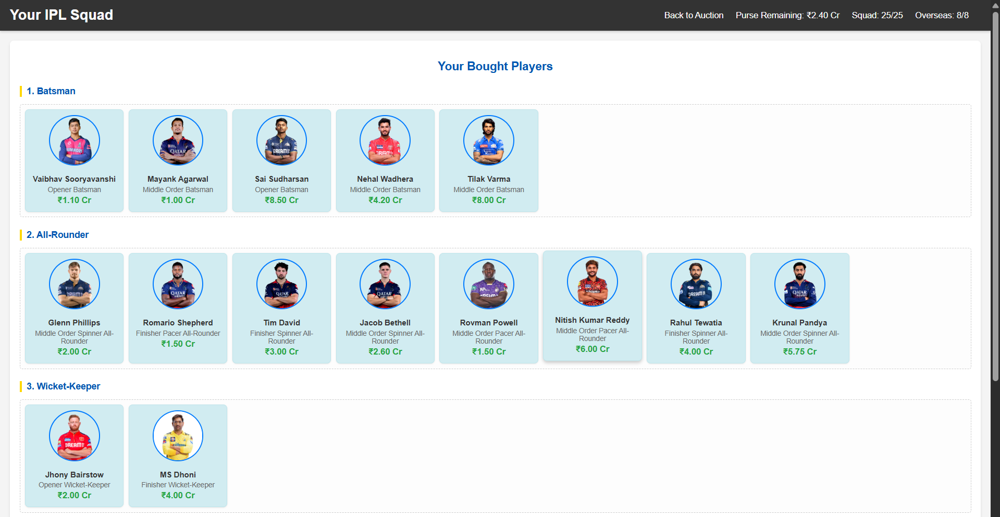

# 🏏 IPL Auction Simulator 🏆

A fun, interactive web-based simulator that lets you build your dream IPL cricket squad with a virtual purse of ₹120 Crores! Buy players from various categories like Openers, Middle Order, Finishers, Spinners, and Pacers, while managing your budget and squad limits (max 25 players, max 8 overseas).

## ✨ Features

* **Virtual Purse:** Start with ₹120 Crores and see it deduct in real-time as you buy players.
* **Player Categories:** Browse players organized by their primary roles (Opener, Middle Order, Finisher, Spinners, Pacers) and sub-roles (Batsman, All-Rounder, Wicket-Keeper).
* **Player Cards:** Each card displays player image, name, role, and price. Overseas players are visually highlighted.
* **Squad Building:** Add players to your team with dynamic updates on total squad size and overseas players.
* **Auction Desk:** View your selected squad categorized by player type (Batsman, All-Rounder, Wicket-Keeper, Spinner, Pacer). This view is available on the main page's right sidebar and also in a dedicated new tab via the "Auction Desk" link in the navbar.
* **Persistent Data:** Your squad and purse data are saved in your browser's local storage, so you won't lose your progress if you close the tab and revisit the site.
* **Reset Auction:** A convenient button to clear your squad and reset your purse for a fresh start.
* **Responsive Design:** Optimized for various screen sizes, including mobile, with adaptive player card layouts (1, 2, or 3 players per row).
* **Sticky Navbar:** Keep an eye on your remaining purse, squad count, and overseas player count as you scroll.

## 🚀 How to Use

1.  **Visit the Live Site:** https://isaansari.github.io/IPL-Auction-Simulator/
2.  Click on any player card on the left side to "buy" them.
3.  Watch your purse deduct and the player appear in your squad on the right side.
4.  Keep an eye on the "Squad" and "Overseas" player counts in the navbar.
5.  Click "Auction Desk" in the navbar to open your complete squad in a new tab.
6.  Use "Reset Auction" to start over.

## 📸 Screenshots

### Main Auction Page

### Your Squad (Auction Desk)

### Mobile View Example

## 🛠️ Technologies Used

* HTML5
* CSS3
* JavaScript (Vanilla JS)

---
*Built with ❤️ by Isa Ansari*
